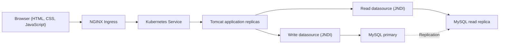
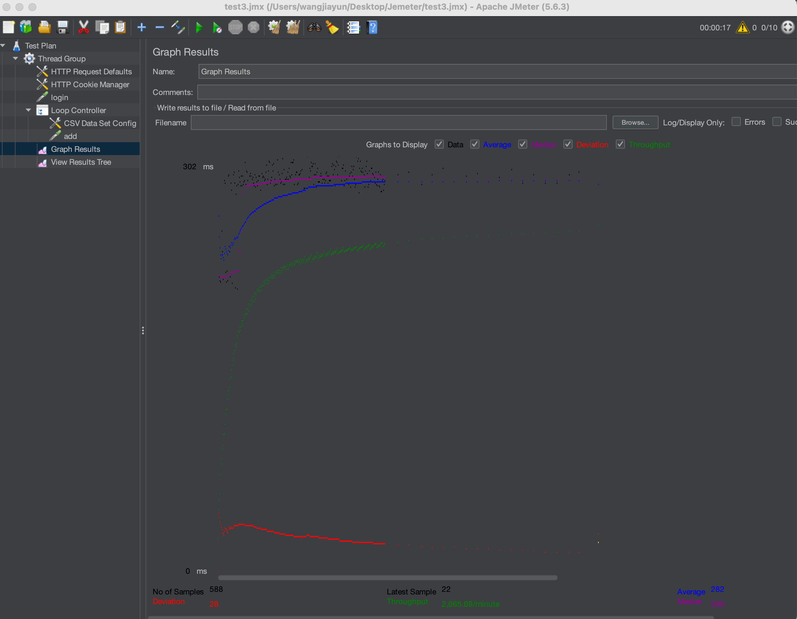
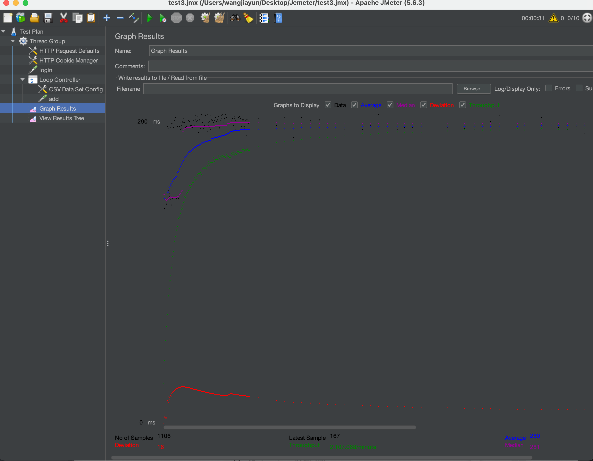

# Fabflix

> A full-stack movie discovery and checkout platform built to explore scalable web architecture, relational data systems, and cloud-native deployment.


[Watch the demo](https://www.youtube.com/watch?v=UDOTG-eKS8Y)

> [!NOTE]
> Fabflix was originally completed in 2024 as a two-person UC Irvine CS 122B project. The repository is preserved as a portfolio and learning project; its original deployment is no longer maintained.

## Overview

Fabflix is a database-backed web application for discovering movies, viewing cast and genre information, managing a shopping cart, and completing a simulated checkout. It combines a browser-based frontend with Jakarta Servlets and MySQL, then extends the application with connection pooling, primary/replica database routing, containerization, load balancing, and Kubernetes deployment.

The project also includes a SAX-based data ingestion pipeline and a JMeter workload for evaluating search performance.

## Highlights

- Search movies by title, year, director, or star
- Browse the catalog by genre or alphanumeric title
- Full-text search, autocomplete, and optional fuzzy matching
- Paginated and sortable movie results
- Movie and star detail pages
- Session-based login and shopping-cart flows
- Simulated credit-card validation and checkout
- Employee dashboard for inspecting schema metadata and adding movies or stars
- Prepared statements for database access
- JNDI connection pooling with separate read and write data sources
- MySQL primary/replica routing for read-heavy workloads
- Multi-stage Docker build and a three-replica Kubernetes deployment
- NGINX Ingress with cookie-based session affinity

## Architecture



Read-oriented endpoints—catalog browsing, search, login lookups, and detail pages—use the replica-facing data source. Checkout and dashboard mutations use the primary-facing data source.

## Technology Stack

| Layer | Technologies |
| --- | --- |
| Frontend | HTML5, CSS, JavaScript, jQuery, Bootstrap |
| Backend | Java 11, Jakarta Servlet API, Gson |
| Data | MySQL 8, JDBC, JNDI, connection pooling |
| Data ingestion | SAX XML parser, batch inserts, validation caches |
| Build and runtime | Maven, Apache Tomcat 10 |
| Infrastructure | Docker, Kubernetes, NGINX Ingress, AWS |
| Performance testing | Apache JMeter |

## Data Ingestion

The ingestion pipeline parses movie, cast, and actor XML files with SAX and loads them into the relational schema. Its main optimizations include:

- batching inserts to reduce transaction overhead;
- indexing movie titles and star names;
- caching missing movies and stars to avoid repeated lookups;
- tracking duplicate or inconsistent records in an error report; and
- using prepared statements and reusable in-memory collections.

## Performance Snapshot

The repository includes the original JMeter test plan and result screenshots. These measurements reflect the 2024 test environment and should be treated as historical results, not a current production SLA.

| Run | Samples | Latest response | Average | Median | Throughput |
| --- | ---: | ---: | ---: | ---: | ---: |
| 1 | 1,106 | 167 ms | 290 ms | 281 ms | 2,107.066 requests/min |
| 2 | 907 | 116 ms | 304 ms | 307 ms | 1,933.559 requests/min |

<details>
<summary>View original JMeter screenshots</summary>

### Run 1



### Run 2



</details>

## Project Structure

```text
.
├── src/                    # Servlets, models, search, checkout, and XML ingestion
├── WebContent/             # HTML, JavaScript, and Tomcat web configuration
├── create_table.sql        # MySQL schema
├── pom.xml                 # Maven WAR build
├── Dockerfile              # Multi-stage Maven and Tomcat image
├── Fabflix.yaml            # Kubernetes Deployment and Service
├── ingress.yaml            # NGINX Ingress and session affinity
└── JmeterTest.jmx          # Search workload and performance test plan
```

## Getting Started

### Prerequisites

- Java 11
- Maven 3.8 or later
- Apache Tomcat 10
- MySQL 8
- A compatible movie dataset; seed data is not included in this repository

### 1. Create the database

```bash
mysql -u root -p < create_table.sql
```

Load your movie dataset after creating the schema.

### 2. Configure the data sources

Update `WebContent/META-INF/context.xml` with your own MySQL hosts and credentials. The application expects two JNDI resources:

- `jdbc/moviedb` for writes to the primary database;
- `jdbc/read` for read traffic.

For local development, both resources can point to the same MySQL instance. Do not commit real credentials.

### 3. Build the application

```bash
mvn clean package
```

The build produces:

```text
target/cs122b-project1-api-example.war
```

### 4. Deploy to Tomcat

Copy the generated WAR into Tomcat's `webapps` directory, start Tomcat, and open:

```text
http://localhost:8080/cs122b-project1-api-example/
```

## Containers and Kubernetes

Build the container image:

```bash
docker build -t fabflix .
```

Before applying the Kubernetes manifests, update the image reference, configure database services and secrets, and verify the Ingress controller is installed.

```bash
kubectl apply -f Fabflix.yaml
kubectl apply -f ingress.yaml
```

The supplied deployment runs three application replicas behind a ClusterIP service. The Ingress configuration uses cookie-based affinity so session-backed requests remain on the same replica.

## Production Hardening

This repository captures an academic implementation and is not production-ready as-is. Before deploying it publicly:

- rotate and externalize all database and third-party credentials;
- replace plaintext password checks with a modern password-hashing scheme;
- enable and verify HTTPS and bot protection;
- move environment-specific values into secrets and configuration;
- add automated tests, health checks, observability, and CI/CD; and
- review the checkout flow against current security and privacy requirements.

## Team

- **Jiayun Wang** — backend servlets, MySQL integration, performance testing, Docker, and debugging
- **Jialiang Huang** — frontend, search experience, AWS/Kubernetes deployment, and project setup

---

Built as a hands-on study of full-stack development, database performance, and distributed deployment.